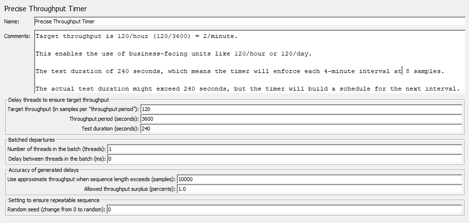

# Learn JMeter

## CSV Data Set Config

* help inject multiple sets of data to the request

## DNS Cache Manager

* allows testing applications, which have several servers behind load balancers when user receives content from different IPs
* add this to a thread group or test plan
* works only with HTTPClient4 implementation
* can specify DNS servers to use (verify using DEBUG log level)
* can specify static hosts (like hosts file)

## HTML Link Parser

* Modifier which parses HTML response from the server and extracts links and forms.

### Use Cases

### Spidering

* By creating a **HTTP Request** sampler with `.*` as the Path and attaching a child **HTML Link Parser**, random link is followed from `Server Name or IP` location.

### Random Test Data

* By adding **parameters** to a **HTTP Request** sampler with `.*` as the `Value`, request params / test data is randomised.

## HTML URL Re-writing Modifier

* easier to use than the HTML Link Parser and more efficient
* extract values from the response
* can carry over / modify parameters from previous **HTTP Request** response, e.g. `jsessionId`.

## Regular Expression Extractor

* allows the user to extract values from a server response using a Perl-type regular expression

Useful parameters: -

* `Name of created variable:` variable to store extracted data
* `Regular Expression:` expression to extract data
* `Template ($i$ where i is capturing group number, starts at 1):` e.g. `$1$`
* `Match No. (0 for Random):` which capture group to match (use `-1` for all)
* `Default Value:` when no match found

## JSON Extractor

* enables the user to extract data from JSON responses using [JsonPath](https://github.com/json-path/JsonPath) syntax
* must be a child of a **HTTP Sampler**

Useful parameters: -

* `Name of created variable:` variable to store extracted data
* `JSON Path expressions:` expressions from which to extract data
* `Match No. (0 for Random):` which capture group to match (use `-1` for all)
* `Compute concatenation var (suffix _ALL):` check to concatenate all results together into an `xxx_ALL` variable
* `Default Values:` when no match found

Usage example
1. Create an order via API HTTP request
2. Capture order ID using **JSON Extractor**
3. Delete order via API HTTP request using captured order ID

## JSON JMESPath Extractor

* allows the user to extract values from structured responses - XML or (X)HTML - using JMESPath query language

* [**J**SON **M**atching **E**xpre**s**sion **P**aths](https://jmespath.org)
* only one JMESPath expression can be entered at any one time

Useful parameters: -

* `Name of created variable:` variable to store extracted data
* `JMESPath expressions:` expressions from which to extract data
* `Match No. (0 for Random):` which capture group to match (use `-1` for all)
* `Default Values:` when no match found

## CSS Selector Extractor

* allows tht user to extract values from a server HTML response using a CSS Selector syntax.

* Uses CSS/jQuery-based syntax
    * JSoup (default)
    * Jodd-Lagarto (CSSelly)

## Boundary Extractor

* allows the user to extract values from a server response using the left and right boundaries.

## XPath2 Extractor

* allows the user to extract value(s) from a structured response - XML or (X)HTML - using XPath2 query language.

Useful parameters: -

* `Name of created variable:` variable to store extracted data
* `XPath query:` XPath query expression from which to extract data
* `Match No. (0 for Random):` which capture group to match (use `-1` for all)
* `Default Value:` when no match found
* `Namespaces aliases list (prefix=full namespace, 1 per line):` 
* `Return entire XPath fragment instead of text content?` 

## Inter-Thread Communication

* enables communication between thread groups
* FIFO queuing
* this is a JMeter plugin (Inter-Thread Communication)

### Elements

* Inter-Thread Communication PostProcessor
* Inter-Thread Communication PreProcessor

Use these to capture a thread variable from one thread group and refer to it in another.

e.g. capture a response variable from a HTTP request using the PostProcessor, retrieve this for use in another thread group using the PreProcessor.

### Functions

* `fifoPut` - put a value onto the queue
* `fifoGet` - get a value from the queue (don't wait for data)
* `fifoPop` - get and remove a string value from the queue (wait for data)
* `fifoSize` - get the number of items in the queue

Use `Tools -> Function Helper Dialog` to build up function calls, etc.

Use the above functions to interact with queues, which are accessible to every thread group for inter-thread communication.

### Functions vs. Plugins

Functions

* queues not cleared automatically
* queues cleared with the first `fifoPut`
* generates random queue name

Plugins

* clears queues at test start and stop

## Timers

* aim is to mimic a real-world scenario.
* injects delays (think time) into tests.
* in JMeter, timers are processed **before** each sampler in the scope

e.g.

* `Test Plan`
  * `Thread Group`
    * `Request 1`
    * `Request 2`
    * `Uniform Random Timer`
    * `View Results Tree`

Order of execution: -

1. `Uniform Random Timer`
2. `Request 1`
3. `Uniform Random Timer`
4. `Request 2`

### Timers in Config

You can update the timer factor in config by changing this config variable: `timer.factor`

1. Open `jmeter.properties` and copy out the commented out section called `Think Time configuration` into `user.properties`

2. Uncomment the `timer.factor` variable and set this to the desired factor.  All timings will be multiplied by this value

3. e.g. `timer.factor=2.0f` will effectively double all timer delay values.

## Uniform Random Timer

### Useful Parameters

* `Random Delay Maximum (in milliseconds):` maximum delay that can be randomly injected
* `Constant Delay Offset (in milliseconds):` constant delay that is always injected

`Total Delay = Random Delay + Constant Delay Offset`

e.g. if `Random Delay Maximum` is 3000ms and `Constant Delay Offset` is 1000ms, the `Total Delay` will be between 1000ms and 4000ms.

## Throughput

* JMeter tries to keep up the throughput
* Throughput depends on available resources, timers and other elements
* Do not change the throughput frequently
* Shared algorithm is more accurate

## Constant Throughput Timer

* This timer introduces variable pauses, calculated to keep the total throughput (samples per minute) as close as possible to a given figure.

* This throughput will be lower if the server isn't capable of handling it or if other timers or time-consuming test elements prevent it.

* Although the Timer is called a Constant Throughput timer, the throughput value doesn't need to be constant - it can be defined in terms of a variable or function call and its value changed during a test.

* The throughput value can be changes in various ways, including: -

  * using a counter variable
  * using a `__jexl3` or `__groovy` function to provide a changing value
  * using the remote BeanShell server to change a JMeter property

## Precise Throughput Timer

* This timer introduces variable pauses, calculated to keep the total throughput (samples per minute) as close as possible to a given figure.

* This throughput will be lower if the server isn't capable of handling it or if other timers or time-consuming test elements prevent it.

* Although the Timer is called a Precise Throughput Timer, it doesn't aim to produce precisely the same number of samples over 1s intervals during testing.

* The timer works best for rates under 36,000 requests/hour; however, mileage may vary!

### Produced Schedule

* `Precise Throughput Timer` models Poisson arrivals schedule, which often happens in real-life so is sensible for load testing.

* Using this, samples are often naturally generated close together, so can reveal concurrency issues.  This is unlikely `Constant Throughput Timer`, which tends to produce samples at even intervals.

### Ramp-up / Startup Spike

* `Precise Throughput Timer` schedules executions in a random way to generate constant load, so don't need to configure ramp-up.  Instead, set `Ramp-up Period` and `Delay` to `0`.

### Multiple Thread Groups Starting at the Same Time

* When using `Precise Throughput Timer` across multiple threads, there's no need to add a "random" delay to each Thread Group to avoid ramp-up issues because `Precise Throughput Timer` schedules executions in a random way.

### Number of Iterations per Hour

* To satisfy business requirements of `N` samples per `M` minutes, map to these parameters as closely to the BRs as possible.  For example "60 samples per hour": -

  * `Target throughput (samples):` `N`
  * `Throughput period (seconds):` (`M` * 60)
  * `Test duration (seconds):` [*desired testing time, e.g. `M` * 60*]

* The first 2 options set the throughput, so `60/3600` could be `30/1800` or `15/900` or `1/60`, but it's best to match the business requirements as closely as possible for clarity.

* Note: `Test duration (seconds)` does **not** limit test duration but is just used as a hint for the timer.  Configure the actual test in the `Thread Group` settings.

### Number of Threads and Think Times

* You should only fiddle with think times and the number of threads to match business requirements, not to game the throughput

* The `Precise Throughput Timer` enables setting a throughput goal and going for it, no matter how well an application performs, by creating a schedule at the test startup and using this to release threads.

### Testing Low Rates and Repeatable Tests

* When testing at low rates (e.g. 60/hour), you need to know the desired test profile, e.g.

  * if load is injected at even intervals (every 60 seconds) then use a `Constant Throughput Timer`

  * if simulating real users and requiring load at random intervals, use a `Precise Throughput Timer`

* Change the `Random seed (change from 0 to random)` to control how repeatable the `Precise Throughput Timer` load test is - 0 will mean completely random load intervals each time, whereas a non-zero number should produce initially random but repeatable load intervals.

* **Note**: beware when using multiple thread groups of timers with the same throughput rates and random seeds - might result in unwanted of simultaneous samples

### Testing High Rates and/or Long Duration Tests

* `Precise Throughput Timer` generates a schedule and keeps it in memory.

* Most of the time this is fine; however, it's usually wise to keep the schedule shorter than 1M samples

  * 1M samples would take ~200ms to generate a schedule for and would consume 8MB of the heap

  * 10M samples would take 1-2s to generate a schedule for and would consume 80MB of the heap

* For example, running a test at 5K samples/hour for 2 weeks would require 2*7*24*5000 = 1.68M samples

### Bursty Load

* Sometimes tests will need to happen in pairs, triples, etc., in which case a `Synchronizing Timer` should be used

* `Precise Throughput Timer` has a native way to issue requests in packs using `Batched departures`: -

  * `Number of threads in the batch (threads):` specifies the number of samples in a batch - this will still be in line with Target Throughput

  * `Delay between threads in the batch (ms):` e.g. set to 42 with a batch size of 3 then the batches will depart at: -

    1. `x`
    2. `x + 42ms`
    3. `x + 84ms`

### Variable Load Rate

* Although property values like throughput can be defined via expressions, it is recommended to keep this value more or less the same throughout the test because it takes time to recompute the new schedule to adapt to the new values.

### Monitoring

Here's a screenshot: -



## Synchronizing Timer

* The purpose of the Synchronizing Timer is to block threads until X number of threads have been blocked, then they can all be released at once.

* Helps trigger N number of threads at the same time.

* A Synchronizing Timer can thus create large instant loads at various points in the test plan.

```c#
if (NumSimultaneousUsersToGroupBy == 0) 
{
    numThreads = ThreadGroup.NumberOfThreads;
}

if (NumSimultaneousUsersToGroupBy < ThreadGroup.NumberOfThreads)
{
    // load will be split
}

if (NumSimultaneousUsersToGroupBy > ThreadGroup.NumberOfThreads)
{
    // no execution
}
```

## Listeners

* Most of the `Listeners` perform several roles in addition to "listening" to the test results, including `View`, `Save` and `Read`.
* Common file formats: `.xml`, `.csv`, `.jtl`
* More listeners -> more memory
* `Sample Data Writer` is an example of a memory efficient listener

## IF Controller

* This allows control of whether a test element's children are run or not.

* By default, condition is evaluated only once initially, but can be configured to evaluate it on every runnable element within the controller.

* By default (and best), check the `Interpret Condition as Variable Expression?` option, then in the condition field either: -

  * Use a variable that contains `true` or `false`, e.g.

    ```javascript
    ${JMeterThread.last_sample_ok}
    ```

  * Use a function (`${__jexl3()}` is advised) to evaluate an expression that must return `true` or `false`, e.g.

    ```javascript
    ${__jexl3(${COUNT} < 10 && "${VAR}" == "abcd",)}
    ```

* Can also uncheck `Interpret Condition as Variable Expression?` and the `If Controller` will internally use javascript to evaluate the condition, which has a performance penalty which can be very big at scale.

* If there is an error interpreting the code, the condition is assumed to be `false` and a message is logged in `jmeter.log`.

## While Controller

* The `While Controller` runs its children until the condition is `false`.
* Possible conditional values are: -

  * blank - exit loop if the last sample fails.  If any other samples fail but the last sample passes, then the loop will not exit.

  * `LAST` - exit loop when last sample fails.  If the last sample fails before the loop, don't loop.

  * Anything else (functions or variable) - exit the loop when the condition is effectively `false`.

* JMeter exposes a looping index variable in the format: -

    ```java
    __jm__<element name>__idx

    // e.g. While Controller is named 'WC' so can access looping index via...
    ${__jm__WC__idx}
    ```

* Can use `__jexl3` or `__groovy` functions, properties or variables within conditions.

## Loop Controller

* JMeter will loop through `Generative` or `Logic Controllers` within a `Loop Controller` a certain number of times - this is in addition to the loop value specified in the `Thread Group`.

* For example, an `HTTP Request` sampler within a `Loop Controller` with a count of 2, within a `Thread Group` with a loop count of 3: a total of 2 * 3 = 6 HTTP Requests will be sent.

* The loop index can be accessed via the following variable: -

    ```java
    __jm__<element name>__idx

    // e.g. While Controller is named 'WC' so can access looping index via...
    ${__jm__WC__idx}
    ```

## Transaction Controller

* The `Transaction Controller` generates an additional sample which measures the overall time taken to perform the nested test elements.

* There are two modes of operation: -

  1. Additional sample is added after the nested samples
  2. Additional sample is added as a parent of the nested samples

* The generated sample time includes all the times for the nested samplers, excluding timers and processing time of pre/post processors by default, unless `Include duration of timer and pre-post processors in generated sample` is checked.

## Throughput Controller

* The `Throughput Controller` allows the user to control how often its children are executed, relative to or irrespective of its parent `Thread Group`.  

* There are 2 modes: -

  1. `Percent executions` - execute a percentage of the iterations through the test plan

  2. `Total executions` - stop executing after a number of executions have occurred.

* Like the `Once Only Controller`, this setting is reset when a parent `Loop Controller` restarts.

* Uses cases including A/B testing, chaos engineering and single/specific executions

## Critical Section Controller

* The `Critical Section Controller` ensures that its children will be executed by only one thread, using a named lock.

## Module Controller

* The `Module Controller` provides a mechanism for substituting test plan fragments into the current test plan at run-time.

* A test plan fragment consists of a Controller and all the test elements (samplers, etc.) contained within it.  

* The fragment can be located in any `Thread Group`.  If the fragment is inside a `Thread Group` then its controller can be disabled to prevent it being run, except by the Module Controller

* Alternatively, store the fragments in a dummy, entirely disabled `Thread Group`.

* The module controller can be used to easily switch between multiple test fragments, each with different sampler children, by simply choosing an appropriate controller in its drop down box.  This is convenient for running alternate test plans quickly and easily.

* A fragment name is made up of the Controller name and all its parent names, e.g.

  ```text
  Test Plan / Protocol: JDBC / Control / Interleave Controller (Module1)
  ```

* Any fragments used by the `Module Controller` must have a unique name - the name is used to find the target controller when a test plan is reloaded.  Best practice is to rename the Controller name from the default to avoid accidental duplication.

## JSR223 Sampler

* The `JSR223 Sampler` allows JSR223 script code to perform a sample or some computation to create/update variables.

* Java Specification Request 223 (AKA JSR223) can be found [here](https://www.jcp.org/en/jsr/detail?id=223)

* This has been withdrawn since 2016 because Java 9 has its own internal scripting engine.

* JSR223 Elements

  1. `JSR223 PreProcessor`
  2. `JSR223 Sampler`
  3. `JSR223 PostProcessor`

* Use `Parameters` to pass in parameters to script

* Use `File Name` to refer to script file instead of inline script.

## Groovy

* Groovy is an agile, dynamic programming language for the Java Virtual Machine.

* Groovy includes features found in Python, Ruby and Smalltalk but uses syntax similar to the Java programming language.

* JSR 241 - can be found [here](https://www.jcp.org/en/jsr/detail?id=241)

* See also https://github.com/apache/groovy 

## JSR223 Variables

### 1. ctx

* context for thread

### 2. vars

* variables
* get
* set
* getObject
* putObject

### 3. props

* properties
* get
* put 

### 4. SampleResult

* pointer to the current SampleResult
* various information returned from taking a sample of an entry

### 5. Sampler

* pointer to the current Sampler

### 6. Log

* Simple logging facade for Java

### 7. Label

* Sampler label name

### 8. File Name

* supply a script file rather than inline scripts.

### 9. Parameters

* use to pass data to JSR223 scripts as a map/hashtable of parameters

### 10. Args

* use to pass data to JSR223 scripts as an array

### 11. OUT

* shorthand for `System.out`.

## File I/O in Groovy

* Open, read, write and manipulate files, e.g.

  ```groovy
  File file = new File ("demo.txt")

  // create
  file.createNewFile()

  // read
  def lines = file.readLines()
  println lines

  def content = "This is my new content.\n"

  // write
  file << content

  def newLines = file.readLines()
  println newLines

  // delete
  file.delete()
  ```

## JSON in Groovy

* Use `JsonSlurper` to parse JSON
* Use "closures" to iterate objects/arrays (similar to Lambda), e.g.

  ```groovy
  import groovy.json.JsonOutput
  import groovy.json.JsonSlurper
  
  def jsonSlurper = new JsonSlurper()
  def json = '''
  {
    "firstName": "John",
    "lastName": "Doe",
    "age": 26,
    "address": {
      "streetAddress": "Naist Street",
      "city": "Nara",
      "postalCode": "630-0192",
    },
    "phoneNumbers": [
      {
        "type": "iPhone",
        "number": "0123-4567-8888",
      },
      {
        "type": "home",
        "number": "0123-4567-8910",
      }
    ]
  }
  '''
  println '*************************************************'

  def obj = jsonSlurper.parseText(json)

  println "First Name: ${obj.firstName}"
  println "Last Name: ${obj.lastName}"
  println "Phone Numbers found: ${obj.phoneNumbers.size()}" 

  // address
  def address = obj.address

  address.each { 
    line -> line.each { 
      println "${line.key}: ${line.value}"
    } 
  }

  // all phone numbers
  def phoneNumbers = obj.phoneNumbers

  phoneNumbers.each { 
    phoneNumber -> phoneNumber.each { 
      type, number -> println "${type}: ${number}" 
    } 
  }

  println '*************************************************'
  ```

## Execution Order & Scoping RUles

### JMeter Execution Order

1. **C**`onfiguration` elements
2. **P**`re-Processors`
3. **T**`imers`
4. **S**`amplers`
5. **P**`ost-Processors` (unless `SampleResult` is `null`)
6. **A**`ssertions` (unless `SampleResult` is `null`)
7. **L**`isteners` (unless `SampleResult` is `null`)

## ^^ **C**`onf` **P**oin**TS** **PAL** ^^

* `Timers`, `Assertions`, `Pre-Processors` and `Post-Processors` are only processed if there is a sampler
* `Logic Controllers` and `Samplers` execute in the order that they appear
* Other elements execute as per the scope

For example

* `Test Plan`
  * `Thread Group`
    * `HTTP Header Manager`
    * `Constant Timer`
    * `jp@gc - Dummy Sampler 1`
      * `jp@gc - JSR223 PostProcessor`
    * `jp@gc - Dummy Sampler 2`
      * `jp@gc - JSR223 PostProcessor`
    * `View Results Tree`

Remembering **Conf** **P**oin**TS** **PAL**

Dummy Sampler 1 Execution Order: -

1. `HTTP Header Manager`
2. `Constant Timer`
3. `Dummy Sampler 1`
4. `Post Processor`
5. `View Results Tree`

Dummy Sampler 2 Execution Order: -

1. `HTTP Header Manager`
2. `Pre Processor`
3. `Constant Timer`
4. `Dummy Sampler 2`
5. `View Results Tree`

### Scoping Rules

* Heirarchical
  * Listeners
  * Config Elements
  * Post-Processors
  * Pre-Processors
  * Assertions
  * Timers

* Ordered
  * Controllers
  * Samplers

## JMeter Plugins

* Extend the functionality of JMeter
* Download to `lib/ext` subdirectory
* Get `Plugins Manager` for easy management
* Also search public repositories for plugins not published to `Plugins Manager`

## Thread Group

* A `Thread Group` defines a pool of users that will execute a particular test case
* Use a `Thread Group` to configure the: -

  * number of simulated users (threads)
  * ramp up time (how long to start all threads)
  * number of times to perform the test
  * start and stop times for the test (optional)

* When using the scheduler, JMeter runs the thread group until either: -
  * the number of loops is reached
  * the duration/end time is reached

* The above end condition is only checked between samples but when it is reached, its thread will stop.

* JMeter won't interrupt samplers waiting for a response

* Run a selection of `Thread Groups` from the GUI by multi-selecting them and right-clicking to choose one of three options: -

  1. `Start` - start selected `Thread Groups`
  2. `Start no pauses` - start selected `Thread Groups` without running timers
  3. `Validate` - start selected `Thread Groups` using `Validation Mode`

### Validation Mode

* This enables rapid validation of a `Thread Group` by running it with: -

  * 1 thread
  * 1 iteration
  * 0 timers
  * a `Startup delay` of `0`

* The above defaults can be modified in `user.properties`

### Ramp-up Period

* This setting is how long JMeter should take to get all of the threads started.

* If there are `10` threads and the ramp-up time is set to `100` seconds, then each thread will begin `100 / 10 = 10` seconds after the previous thread started.

* The first thread will always start directly (so a single-threaded `Thread Group` effectively ignores its `Startup delay` setting), so the tenth thread in the above example will actually start after 90 seconds, not 100.

## Load Testing

* Load testing helps you to study the application behaviour under defined load.

* Use JMeter in CLI mode to execute load tests: -

  ```bash
  # shorthand
  jmeter -n -t [jmx file] -l [results file] -e -o [Path to web report folder]

  # longhand
  jmeter \
    --nongui \
    --testfile [jmx file] \
    --logfile [results file] \
    --reportatendofloadtests \
    --reportoutputfolder [Path to web report folder]
  ```

## Reading from a Properties File

* Reading from a Properties File helps to automate and integrate with a CI/CD pipeline and increase flexibility

* Load this Properties File into a project using command line argument: -

  ```bash
  # shorthand
  jmeter -q [additional property file(s)]

  # longhand
  jmeter --addprop [additional property file(s)]
  ```

* Example `test.properties` file: -

  ```properties
  numberofthreads=10
  url=example.com
  protocol=https
  testduration=30
  loop=50
  ```

* This can be applied to a consuming JMeter project using: -

  ```bash
  jmeter \
    --nongui \
    --testfile Read-from-Properties-Demo.jmx \
    --logfile Read-from-Properties-Demo.jtl \
    --addprop test.properties
  ```

## Server Performance Monitoring

* It is critical to monitor the performance of the servers being tested.

* Many metrics can be monitored, for example: -

  * CPU
  * Memory
  * Network
  * Disk
  * Swap

### PerfMon Server Agent

See https://github.com/undera/perfmon-agent

* This is a JMeter agent, written in Java, so executable on Windows or Linux platforms.

* Collects and sends back server telemetry over port 4444 (default)

* Usage: -

  * Windows

    ```powershell
    ./startAgent.bat
    ```

  * Linux

    ```bash
    ./startAgent.sh
    ```

* Installation

  * Download and install **PerfMon Metrics Collector** JMeter plugin
  * Add `jp@gc - PerfMon Metrics Collector` Listener to Test Plan
  * Configure servers to monitor, port (`4444` by default), metrics to collect, etc.

* Testing
  * Start the `PerfMon Server Agent` on the target server
    * locally using `startAgent.bat`, etc.

    or

    * using docker, e.g.

      ```powershell
      docker run `
        --detach `
        --publish 4444:4444 `
        --name perfmon-agent `
        hongviet119/perfmon-server-agent
      ```

  * Test connectivity by Validating the Test Plan

## Running JMeter on Docker

### Docker Commands

```powershell
# pull docker image
docker pull justb4/jmeter

# tag as meaningful name
docker tag justb4/jmeter jmeter

# now both aliases appear in docker images
docker images
<#

  REPOSITORY                         TAG       IMAGE ID       CREATED        SIZE
  docker/getting-started             latest    083d7564d904   3 months ago   28MB
  jmeter                             latest    62f762a118ed   4 months ago   238MB
  justb4/jmeter                      latest    62f762a118ed   4 months ago   238MB
  hongviet119/perfmon-server-agent   2.2.3     c27351d5ab9d   2 years ago    283MB

#>

# run JMeter in Docker on example Test Plan
docker run jmeter `
  --nongui `
  --testfile bin/examples/CSVSample.jmx `
  --logfile bin/examples/Run1.jtl

```

* The above solution isn't great because it creates local results files - better to use `--mount` flag to map a specific folder to the container.

## Remote Distributed Testing in JMeter

* Needed for testing high loads - e.g. it would be impossible to run 10,000 threads from a single machine, so need to distribute the workload

* Topology is master JMeter controller, sending commands to and receiving results from, JMeter workers, effectively distributing the workload

### Configuration Steps

1. Configure Worker Nodes
2. Configure Master Node
3. Start the test

### Important Considerations

1. `SSL Setup` - by default this is enabled for this configuration
2. `Same subnet` - master and workers must be on same network subnet
3. `Identical Java/JMeter versions` - across master and workers

### Check Versions

```powershell
java -version
jmeter --version
```

### Configure Remote Hosts

```properties
# %JMETER_HOME%/bin/jmeter.properties

# Add remote hosts (workers) - e.g. my local docker instance of jmeter-server
remote_hosts=127.0.0.1:10990

# Disable SSL for RMI if testing over HTTP
server.rmi.ssl.disable=true
```

### Run jmeter-server in Docker container

```powershell
docker run `
  --detach `
  --publish 10990:10990 `
  --publish 10991:10991 `
  --publish 10992:10992 `
  --env JVM_ARGS="-Djava.rmi.server.hostname=192.168.1.77" `
  --env HEAP="-XX:InitialRAMPercentage=50 -XX:MaxRAMPercentage=75 -XX:MetaspaceSize=96m -XX:MaxMetaspaceSize=256m" `
  --env RUN_IN_DOCKER="-XX:+UnlockExperimentalVMOptions -XX:+UseContainerSupport" `
  mansy0/jmeter-server  
```

(can also omit the `--detach` flag or re-attach to container using `docker attach` to see its logs in real time.)

### Run a JMeter test remotely

* In the GUI, `Run -> Remote Start -> [remote server]`

### Considerations

* `Thread Group -> Number of Threads (users):` setting applies to **all** remote hosts - it's not divided across all hosts, so any sharing calculation must be done manually.

### Using SSL

* Config values to pay attention to: -

  ```properties
  # jmeter.properties

  # Key alias
  server.rmi.ssl.keystore.alias=rmi

  # Password of keystore
  server.rmi.ssl.keystore.password=changeit
  ```

* Create RMI Key Store

  ```powershell
  # edit this file to change alias and password
  & "%JMETER_HOME%\bin\create-rmi-keystore.bat"
  ```

  This creates a file - `rmi_keystore.jks` - in the `bin\` directory.  Make sure it is copied to all remote hosts for SSL connectivity.

* Copy Key Store to remote hosts

  ```powershell
  docker cp `
    "$env:JMETER_HOME\bin\rmi_keystore.jks" `
    "b3e6d158e32c:/usr/local/jmeter/bin/rmi_keystore.jks"
  ```

* Re-enable SSL on ALL hosts

  ```properties
  # %JMETER_HOME%/bin/jmeter.properties
  
  # Re-enable SSL for RMI
  server.rmi.ssl.disable=false
  ```

### Run Distributed Testing without GUI

```bash
# shorthand
jmeter -n -t <JMX file> -l <JTL file> -R <remote host>

# longhand
jmeter \
  --nongui \
  --testfile <JMX file> \
  --logfile <JTL file> \
  --remotestart <remote host>
```

## Writing Your Own Groovy Functions

* JMeter has a built-in `__groovy` function to evaluate expressions, e.g.

  ```java
  ${__groovy(1+2,)}
  ```

* You can also write your own Groovy snippets, e.g.

  ```java
  ${__groovy(square(5),)}
  ```

* Set the `groovy.utilities` property to the path of your Groovy script file containing utility functions (`bin/utility.groovy` by default) via either: -

  * In `user.properties` (recommended)
  * In `jmeter.properties`
  * At the command line: -

    ```powershell
    # shorthand
    jmeter -Jgroovy.utilities=utility.groovy

    # longhand
    jmeter --jmeterproperty "groovy.utilities=utility.groovy"
    ```

  * You can now add new utility functions to this file.

## Workload Models

* Distribution of transactions

* Simulating the workload helps to understand how a system works

* There are 2 types of workload model: Open and Closed

### Open Workload Model

* most websites operate with this model
* allow everyone access all the time
* new requests arrive independently of completions (e.g. according to stochastic process or fixed trace)
* increased load gradually degrades system performance and eventually overwhelms it
* when testing, define the arrival rate
* Use `bzm - Arrivals Thread Group` / `gp@gc - Active Threads Over Time`

#### Arrivals Thread Group

Specify key parameters including: -

* `Target Rate (arrivals/sec):`
* `Ramp-up Time (sec):`
* `Ramp-up Steps Count:`
* `Hold Target Rate Time (sec):`

* `Concurrency Limit`: limit the number of threads available to the test

Specifying the above will allow the Arrivals Thread Group to design a load test schedule to meet this criteria.

#### Free-Form Arrivals Thread Group

Specify the Threads Schedule to design a custom test schedule by defining each test phase, its intensity and duration via the following key parameters: -

* `Start Value`
* `End Value`
* `Duration`

* Thread Iterations Limit: 
* `Concurrency Limit`: limit the number of threads available to the test

### Closed Workload Model

* many ticketing websites operate with this model to ensure a steady stream of sales and consistent experience during busy periods
* new requests are triggered by the completion of a previous request
* queuing mechanism often implemented to prevent the system from being overwhelmed
* when testing, define the concurrency rate (e.g. 20 threads)

#### Concurrent Threads Thread Group

Specify the number of concurrent threads, ramp-up and hold at target rate time, then let the Thread Group design a schedule to achieve this, specifying the following key parameters: -

* `Target Concurrency:`
* `Ramp-up Time (sec):`
* `Ramp-up Steps Count:`
* `Hold Target Rate Time (sec):`

#### Ultimate Thread Group

Specify a symmetrical startup and shutdown schedule based on the number of threads and the amount of time taken to startup, hold and shutdown, specifying key parameters including: -

* `Start Threads Count`
* `Initial Delay, sec`
* `Startup Time, sec`
* `Hold Load For, sec`
* `Shutdown Time`

## BeanShell Server

* Can run a BSH server locally and invoke commands on it to affect runtime variables on the fly.

* For example, reduce the timer precision from 1000 to 10 (increase throughput) during a running load test: -

  ```powershell
  # reduce timer precision to increase throughput during running test
  java -jar ..\lib\bshclient.jar localhost 9000 ..\extras\update.bsh 10
  ```

* *NB: the number of threads cannot be changed by a BSH server*

## Flow Control Actions versus Timers

* Can use `Add Think Time` or `Timers` to insert delays between `Samplers` depending on business requirements and test writing style

* Remember that `Timers` take precedence

### Flow Control Action

* The `Flow Control Action` sampler is intended for use in a conditional controller

* Rather than generate a sample, the test element either pauses or stops the selected target.

* Useful in conjunction with the `Transaction Controller` because it allows pauses to be included without needing to generate a sample

* Actions

  * `Pause` - pause the current thread or test

  * `Stop` - stop the thread or test after completing any samples in progress

  * `Stop Now` - stop the test without waiting for samples to complete, interrupting any active samples

  * `Go to next loop iteration` - effectively a `continue`

  * Adding `Think Times` to `Thread Group` children allows fixed duration (set in `Flow Control Action`) and random delays (set in child `Uniform Random Timer`) as needed